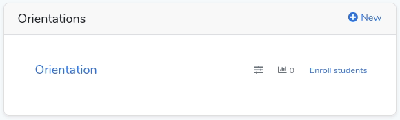
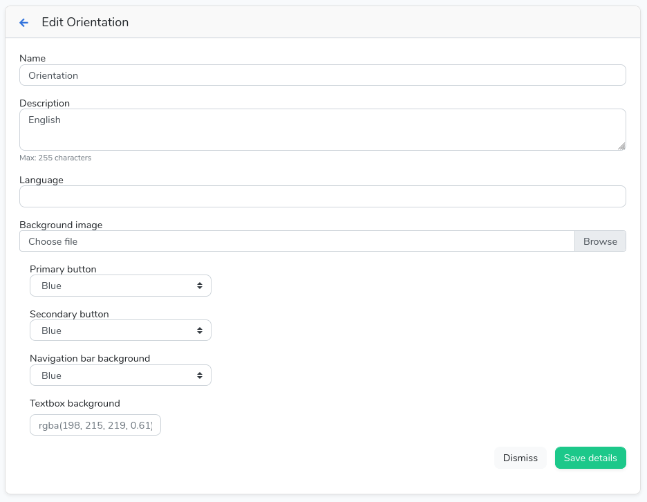

# Administration resources
> This guide is intended for System Administrators or personnel in charge of managing an instance of **on_board**. If you are an advisor, or a student, please refer to the corresponding documentation using the sidebar menu.

## Institution Setup
This is an important section of the overall system, as the information here will be used by students to communicate with your Institution right from within on_board.
To get your Institution's contact information in the system simply:
1. **As an Administrator**, Go to Settings > Institution
2. Enter all necessary information, then click **Save**.

## Front Page Setup
By default, when you navigate to your *on_board* instance you will be presented with the login screen.
In some occasions it may be important to showcase any kind of information related to your organization.

Fortunately, this is something very easy to do here :wink:.
1. **As an Administrator**, Go to Settings > Front Page.
2. Paste or manually enter your HTML content here, then click **Save**.
3. Done! Now when you go to https://your-on_board.com you will be greeted with the content you just added.

## Working with Orientations
> It may seem overwhelming but really, is not. We made it an easy for administrators to work with orientations.

In this section you will learn how to create and edit orientations, add and edit sections, enroll students, and view and export reports on student progress by orientation.
### Creating an orientation
To create an orientation:
1. Go to your Dashboard, then click **New** on the header of the Orientations card.
2. Enter a name, description, and language, then click **Save**. *(The language field is for informative purposes only.

### Editing the orientation settings
On your Dashboard, select the *sliders* icon next to the orientation you need to edit. 

Once inside, you will see various options that will define how the orientation will look for the students.

* **Name**: *The name of the orientation*.
* **Description**: *The description of the orientation*.
* **Language**: *The language of the orientation. Please notice this is optional and is only for informative purposes*.
* **Background image**: *Sets the orientation background image. This helps give your orientations a sense a more professional look*.
* **Primary button**: *The color the 'Next' and 'Finish' orientation navigation buttons*.
* **Secondary button**: *The color the 'Previous' orientation navigation button*.
* **Navigation bar background**: *The background color for the orientation navigation menu*.
* **Textbox background**: *The background color for the orientation presentation area*.

### Adding sections
1. To add a section, select the orientation on which you would like to perform the operation.
2. Once inside, click the **Add section**.
3. Select the type of section, then click **Select**.
4. Fill in the required contents for the section.
5. Click **Save** when you are done.

### Enrolling students
1. Click the **Enroll students** button next to the orientation you would like to enroll them into.
2. Select the students, then click **Enroll**.

#### Enrolling students without an account
It is also possible to enroll students even when they haven't created an account.
1. To do this, go to the **Users** area.
2. Click **Invite**.
3. Enter the student name, email, and select the orientation you want to enroll the student into.
4. Click **Save** when done.
  * Students will receive an email asking them to sign up. When they sign up, they will be able to start their orientation right away.

### Track student progress
We currently provide a simple, yet informative tool that allows administrators and advisors to track each individual student progress.

* To do this, simply click the **Statistics / Enrolled students** button next to the orientation you would like to check on.
